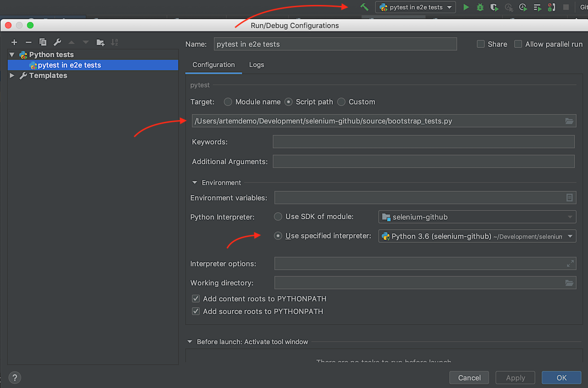

# How to setup project

Project is developed with IntelliJ IDE.

First you'll need to generate `venv` folder I did it with the IDE:

1. `File` -> `Project Structure`
1. Select `Platform Settings`, submenu `SDKs`
1. Click on `+`
1. Select Python SDK
    * Location - where to place `venv` in the current project
    * Base interpreter. I used Python 3.6
1. `Ok`

Then activate environment.
Run via **IDE terminal** (after activation you should see `(venv)` in the terminal above each command line):

`$ source ./venv/bin/activate`

Install requirements with pip:

`$ pip install -r ./requirements`

Then add run configuration:



By the way this configuration should be saved in `./idea` folder,
and therefore should be available in the project right away.

## Install chromedrive on mac

In order to run test on your local machine you'll need to install chrome drive:
```
$ brew cask install chromedriver
```

After that you should be able to run tests.

It is possible that you'll get following error (see the last line in the error stack):
```
SessionNotCreatedException session not created: This version of ChromeDriver only supports Chrome version 75
```

It means that your local chrome is not the same version as chrome drive. Update google chrome.
